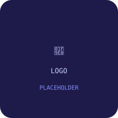
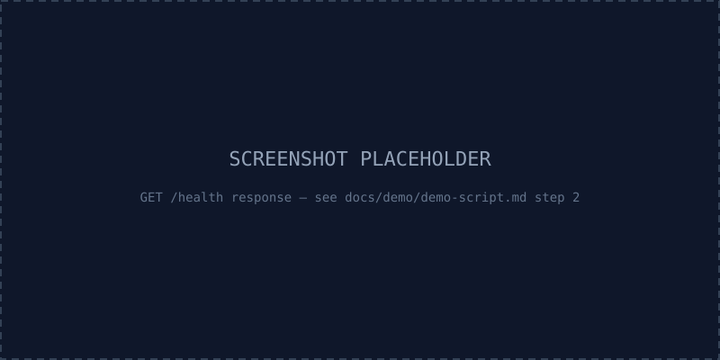
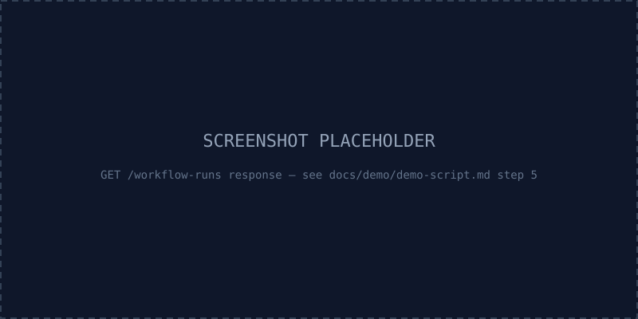
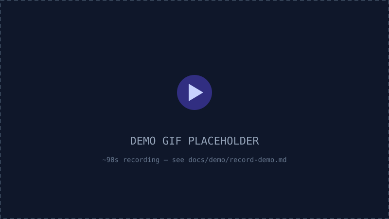

<div align="center">



<!-- TODO (v0.3+): replace assets/logo-placeholder.svg with a real logo -->

# 🧠 FlowMind AI

**AI-powered workflow automation — webhook in, Claude/OpenAI/Gemini in the middle, Slack out.**

[](https://github.com/MatheusHenrique007/flowmind-ai/actions/workflows/ci.yml)
[](LICENSE)
[](package.json)
[](pnpm-workspace.yaml)
[](tsconfig.json)
[](CONTRIBUTING.md)

**Current Version**: v0.7.0 · **Status**: Workflow Management · **Next**: unscheduled (see [Roadmap](#roadmap))

</div>

---

## Why FlowMind?

Most "AI workflow" portfolio projects stop at a wired-together demo. FlowMind AI is built the way
a real product team would build it, in public, one Release at a time:

- **Product decisions before code** — every Release has a PRD (`docs/prd/`) answering who uses
  it, how it's demoed, and what's explicitly out of scope, written _before_ implementation starts.
- **Clean Architecture enforced by tooling, not convention** — Domain and Application have zero
  infrastructure imports, checked by a dedicated ESLint rule that's been proven to actually fire
  (see [ADR-0001](docs/adr/0001-foundation-decisions.md), [ADR-0002](docs/adr/0002-workflow-engine-contracts.md)).
- **Honesty over appearances** — when a plan didn't survive contact with implementation (see the
  [v0.2.2 correction note](docs/adr/0002-workflow-engine-contracts.md#implementation-note-added-v022)),
  the docs say so instead of quietly rewriting history.
- **Real tests against real infrastructure** — the Prisma integration tests run against an actual
  Postgres, in CI, not a mock.

## Project Status

|                                  |                                                                                                                                                                                                                                                                                                                                                                                                   |
| -------------------------------- | ------------------------------------------------------------------------------------------------------------------------------------------------------------------------------------------------------------------------------------------------------------------------------------------------------------------------------------------------------------------------------------------------- |
| **Version**                      | v0.7.0                                                                                                                                                                                                                                                                                                                                                                                            |
| **Stage**                        | Visual editor, multi-tenant auth, multi-provider AI, recurring Schedules, and workflow listing/reopening all shipped                                                                                                                                                                                                                                                                              |
| **What works today**             | `Webhook → (Claude \| OpenAI \| Gemini) → Slack` authored visually, workspace-scoped auth, full run history, dependency health check, recurring UTC-cron `Schedule`s, and a "My Workflows" list to reopen and edit any previously-saved Workflow instead of only ever building a new one; any AI step with no matching API key runs against a clearly-labeled `MockAIProvider` instead of failing |
| **What doesn't exist yet**       | Deleting a Workflow, timezone support, pausing a Schedule, runtime fallback between AI providers, additional triggers/destinations, billing                                                                                                                                                                                                                                                       |
| **CI**                           |                                                                                                                                                                                                                                                                                                        |
| **Test coverage (this release)** | 60+ unit tests (Domain/Application/Engine) + real Postgres + real Redis integration tests                                                                                                                                                                                                                                                                                                         |

## Quick Start

Three commands, assuming Docker is running:

```bash
git clone https://github.com/MatheusHenrique007/flowmind-ai.git && cd flowmind-ai
pnpm install && cp .env.example .env
pnpm demo
```

That's it — `pnpm demo` brings up Postgres/Redis, seeds the demo workflow, boots the API, fires
the webhook, and prints the result. See [Run the demo](#run-the-demo) below for what to expect
with and without real `ANTHROPIC_API_KEY`/`OPENAI_API_KEY`/`GEMINI_API_KEY`/`SLACK_BOT_TOKEN`
values — with none of them set, the AI step now succeeds against a clearly-labeled
`MockAIProvider` instead of failing (see
[ADR-0005](docs/adr/0005-provider-selection-strategy.md)).

FlowMind AI is a B2B SaaS workflow automation platform, in the spirit of Zapier or n8n: users
compose triggers, AI steps, and integrations into automated workflows. **v0.1.0** built the
monorepo foundation; **v0.2.0** proved the execution engine end to end with one hardcoded
workflow; **v0.2.1**/**v0.2.2** turned that technical MVP into something anyone can clone,
configure, and demo in under 10 minutes; **v0.3.0** replaced the seed script with a visual,
React Flow-based editor; **v0.4.0** added workspace-scoped multi-tenant auth; **v0.5.0** added
real OpenAI/Gemini adapters alongside Claude, with a mock-provider fallback for undemoed keys;
**v0.6.0** added recurring, UTC-cron `Schedule`s that trigger a Workflow automatically via
BullMQ's Job Scheduler API, with no timezone support yet; **v0.7.0** added a "My Workflows" list
page and the ability to reopen and edit an existing Workflow instead of only ever creating a new
one.

Visual, React Flow-based editor lives in `apps/web` (shipped v0.3.0) — see [Roadmap](#roadmap).

## Key features

- **Webhook → AI → Slack**, wired end to end: a `POST` request triggers a BullMQ job, a Worker
  runs the Engine, Claude summarizes the input, Slack gets notified.
- **Full run history**: every execution is persisted with per-step status, timing, and errors —
  queryable via `GET /workflow-runs`.
- **Dependency health check**: `GET /health` reports Postgres, Redis, the queue, and whether AI/
  Slack credentials are even configured — before you go looking for why something failed.
- **One-command demo**: `pnpm demo` brings up dependencies, seeds data, boots the API, fires the
  webhook, and prints the result — no manual steps, no manual SQL.
- **Clean Architecture, strictly enforced**: Domain and Application layers have zero
  infrastructure imports — verified by a dedicated ESLint rule, not just a comment.

## Architecture

Clean Architecture, manual dependency injection (no DI framework, no decorators) — full write-up
in [docs/architecture/ARCHITECTURE.md](docs/architecture/ARCHITECTURE.md).

```
User
  │
  ▼
Webhook  ──POST /webhooks/:workflowId──▶  Fastify API
                                              │  enqueues only
                                              ▼
                                            Queue (BullMQ / Redis)
                                              │
                                              ▼
                                            Worker  ──▶  ExecuteWorkflow (Application)
                                                              │
                                                              ▼
                                                          Engine (packages/engine)
                                                              │  Trigger → AI → Destination
                                                              ▼
                                                          Claude  →  Slack
                                                              │
                                                              ▼
                                                          PostgreSQL (run history)
```

- **Domain** (`packages/domain`) — `Workflow`/`WorkflowRun`/`WorkflowStep`, zero external deps.
- **Application** (`packages/application`) — use cases (`ExecuteWorkflow`, `GetWorkflowRun`,
  `ListWorkflowRuns`) and the ports Infrastructure implements. Depends only on Domain.
- **Engine** (`packages/engine`) — runs a Workflow's steps sequentially through a
  `StepExecutorRegistry`; knows only the `AIProvider`/`Destination` contracts, never a concrete
  provider or destination directly.
- **Infrastructure** — Prisma repositories, `ClaudeProvider`/`OpenAIProvider`/`GeminiProvider`/
  `MockAIProvider`, `SlackDestination`, the BullMQ queue/worker. Implements Application's ports.
- **Presentation** (`apps/api`) — Fastify routes and the composition root that wires everything.

## Monorepo structure

```
flowmind-ai/
├── apps/
│   ├── api/                     # Fastify HTTP API (Presentation) + composition root
│   └── web/                     # Next.js frontend (Presentation) — visual editor + auth pages
├── packages/
│   ├── domain/                  # @flowmind/domain
│   ├── application/             # @flowmind/application
│   ├── engine/                  # @flowmind/engine
│   ├── infrastructure/          # @flowmind/infrastructure (Prisma, BullMQ, health check)
│   ├── ai/
│   │   ├── contracts/           # @flowmind/ai-contracts (AIProvider port)
│   │   ├── factory/              # @flowmind/ai-factory — stub, not wired; the composition
│   │   │                         #   root uses an injected resolver function instead
│   │   ├── claude/              # @flowmind/ai-claude — real (@anthropic-ai/sdk)
│   │   ├── openai/               # @flowmind/ai-openai — stub, not wired yet
│   │   └── gemini/               # @flowmind/ai-gemini — stub, not wired yet
│   └── destinations/
│       ├── contracts/           # @flowmind/destinations-contracts (Destination port)
│       └── slack/                # @flowmind/destinations-slack — real (fetch, no SDK)
├── docs/
│   ├── architecture/            # ARCHITECTURE.md, tech-stack.md
│   ├── adr/                     # Architecture Decision Records
│   ├── prd/                     # Product Requirements Docs per release
│   └── demo/                    # demo-script.md, record-demo.md
├── scripts/
│   └── demo.mjs                 # `pnpm demo`
├── assets/                       # logo/screenshot/GIF placeholders (see assets/README.md)
└── docker-compose.yml            # Postgres + Redis
```

## Tech stack

**Backend**: Node.js, TypeScript, Fastify, Prisma + PostgreSQL, Redis + BullMQ, Zod, Anthropic
SDK. **Frontend**: Next.js 15, React 19, Tailwind, React Flow, TanStack Query, Zustand (scaffolded,
not the focus of this release). **Infra**: Docker Compose, pnpm workspaces + Turborepo, GitHub
Actions. **Quality**: Vitest, Playwright, ESLint 9, Prettier, Husky.

Frozen as the official stack — see [ADR-0001](docs/adr/0001-foundation-decisions.md). Full list:
[docs/architecture/tech-stack.md](docs/architecture/tech-stack.md).

## Installation

Requires Node.js ≥20, pnpm ≥9, and Docker (for Postgres/Redis).

```bash
git clone https://github.com/MatheusHenrique007/flowmind-ai.git
cd flowmind-ai
pnpm install
```

## Configuring `.env`

```bash
cp .env.example .env
```

`.env.example` documents every variable and separates **required** (`DATABASE_URL`, `REDIS_URL`
— the app won't boot without these; the defaults already match `docker-compose.yml`) from
**optional** (`ANTHROPIC_API_KEY`, `SLACK_BOT_TOKEN`, `SLACK_CHANNEL` — the app boots without
them, `GET /health` reports them as `not_configured`, and the matching workflow step fails with a
clear error instead of crashing).

## Running locally

```bash
docker compose up -d   # Postgres + Redis
pnpm seed               # creates the demo workflow
pnpm --filter @flowmind/api dev
```

```bash
curl http://localhost:3001/health
```

## Run the demo

```bash
pnpm demo
```

This single command validates your environment, starts Postgres/Redis, seeds the demo workflow,
boots the API, fires the webhook, and prints each step's result — including a clear error message
if `ANTHROPIC_API_KEY`/`SLACK_BOT_TOKEN` aren't set, rather than a crash. For the manual,
narratable version (useful for recording a video), see
[docs/demo/demo-script.md](docs/demo/demo-script.md).

## Screenshots

<!-- TODO (v0.3+): replace both SVGs below with real screenshots -->

<p>
  
  
</p>

No workflow-authoring UI yet — this release is API + Worker only. Real UI screenshots land once
the visual editor (v0.3+) ships.

## Demo GIF

<!-- TODO: record per docs/demo/record-demo.md and replace this placeholder -->



See [docs/demo/record-demo.md](docs/demo/record-demo.md) for exactly how to record the real one.

## Roadmap

- **v0.1.0** — Monorepo foundation, tooling, CI ✅
- **v0.2.0** — Execution engine proven end to end (Webhook → Claude → Slack) ✅
- **v0.2.1** — Product polish: README, demo command, health check, seed script ✅
- **v0.2.2** — GitHub showcase: fixed doc/code divergences, Quick Start, recording guide ✅
- **v0.3.0** — Visual Workflow Builder (React Flow canvas authors the workflow) ✅
- **v0.4.0** — Multi-Tenant Auth (register/login, workspace-scoped workflows) ✅
- **v0.5.0** — Multi-Provider AI (real OpenAI/Gemini adapters, mock-provider fallback) ✅
- **v0.6.0** — Scheduling (UTC-cron `Schedule`s, BullMQ Job Scheduler API) ✅
- **v0.7.0** — Workflow Management (list/reopen/edit existing Workflows) ✅ (this release)
- **Future** — Deleting a Workflow, timezone support, pausing a Schedule, runtime fallback between
  AI providers, billing, node marketplace

See [ROADMAP.md](ROADMAP.md) for full detail on every release.

Full detail: [ROADMAP.md](ROADMAP.md).

## Definition of Done — Release v0.1.0

- [x] Monorepo created
- [x] GitHub configured (templates, CODEOWNERS, branch protection on `main`)
- [x] CI green (lint, typecheck, test, build, e2e) — all 5 checks passing on
      [PR #1](https://github.com/MatheusHenrique007/flowmind-ai/pull/1), merged into `main`
- [x] Docker Compose brings up PostgreSQL and Redis — verified during v0.2.0 once Docker Desktop's
      backend was fixed: `docker compose up -d` starts both containers, Prisma migrations and the
      full webhook → Slack pipeline ran against them for real
- [x] API starts correctly (`/health` responds) — verified locally
- [x] Web starts correctly (landing page renders) — verified locally
- [x] Lint/typecheck/test/build green
- [x] Husky/commitlint working, first push to `main` completed

## Definition of Done — Release v0.2.0

- [x] Domain layer (Workflow/WorkflowRun/WorkflowStep/ExecutionContext) — 37 unit tests
- [x] Application layer (ExecuteWorkflow, GetWorkflowRun, ListWorkflowRuns + ports) — 11 unit tests
- [x] Engine (StepExecutorRegistry + 3 executors, sequential, Clock-timestamped) — 16 unit tests
- [x] Infrastructure: Prisma repositories, ClaudeProvider, SlackDestination, BullMQ queue/worker,
      Fastify routes, composition root
- [x] Prisma integration tests run for real against Postgres (locally and in CI)
- [x] Smoke Test: booted `apps/api` against real Postgres + Redis, fired the webhook, watched
      Trigger succeed, AI call the real Anthropic API and fail on an intentionally fake key, run
      correctly recorded `FAILED`, stopped before the Destination step
- [x] Lint/typecheck/test/build green across all 22 packages/apps

## Definition of Done — Release v0.2.1

- [x] Professional README (this file)
- [x] `pnpm demo` — validates env, starts dependencies, seeds, runs the flow, reports the result
- [x] `pnpm seed` — populates the demo workflow, no manual SQL ever required
- [x] `.env.example` documents every variable, Required vs Optional clearly separated
- [x] `GET /health` reports Postgres/Redis/queue connectivity and AI/Slack configuration status
- [x] [docs/demo/demo-script.md](docs/demo/demo-script.md) — ~2-minute manual walkthrough
- [x] Architecture diagram (this file + ARCHITECTURE.md)
- [x] Lint/typecheck/test/build green — no changes to Domain/Application/Engine business logic;
      Infrastructure/Presentation touched only for the health check and dotenv loading (see PR
      description for the full list and the real bugs this release's manual testing caught)

## Definition of Done — Release v0.2.2

- [x] All doc/code divergences found and fixed, not silently — see the
      [ADR-0002 implementation note](docs/adr/0002-workflow-engine-contracts.md#implementation-note-added-v022)
      and the corresponding correction in the [v0.2.0 PRD](docs/prd/v0.2.0-execution-engine.md)
- [x] README: badges, Why FlowMind?, Project Status, 3-command Quick Start, highlighted
      architecture, GIF/screenshot placeholders (real SVGs in `assets/`, not broken links)
- [x] [docs/demo/record-demo.md](docs/demo/record-demo.md) — how to record the real 90-second demo
- [x] `assets/` created with logo/screenshot/GIF placeholders and its own README explaining what
      to replace each with
- [x] Zero product functionality changed — Domain/Application/Engine/Infrastructure untouched
- [x] Lint/typecheck/test/build green — confirms the doc-only nature of this release

## Contributing

See [CONTRIBUTING.md](CONTRIBUTING.md) for branching strategy, commit conventions, and the
local checks to run before opening a PR.

## License

[MIT](LICENSE)
